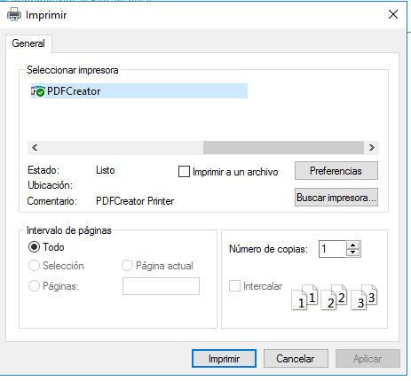
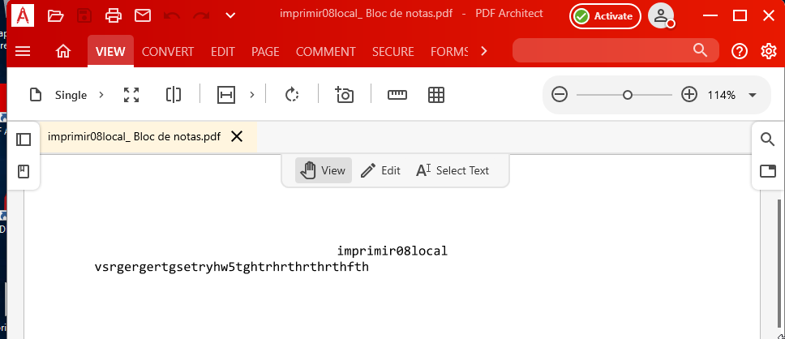
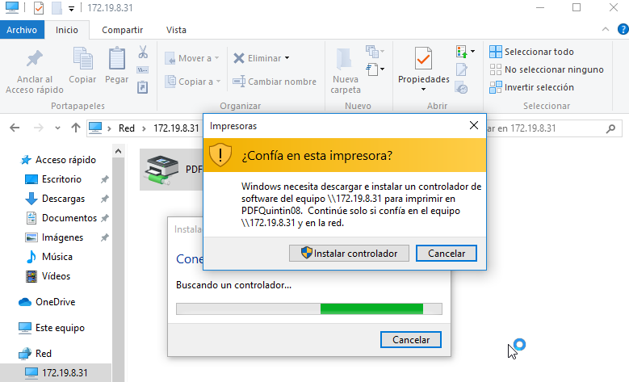
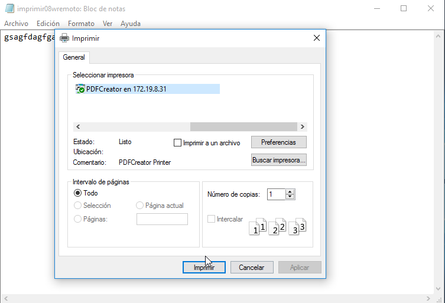
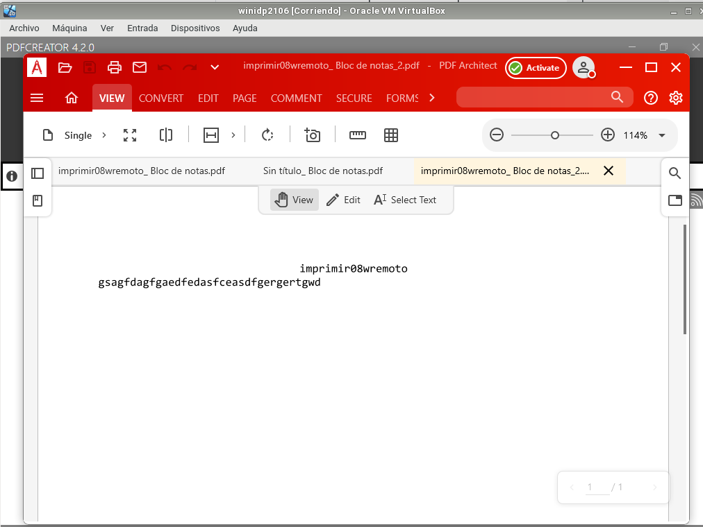
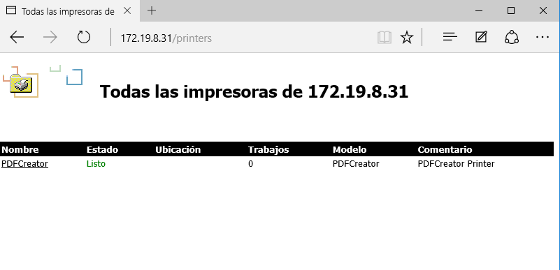
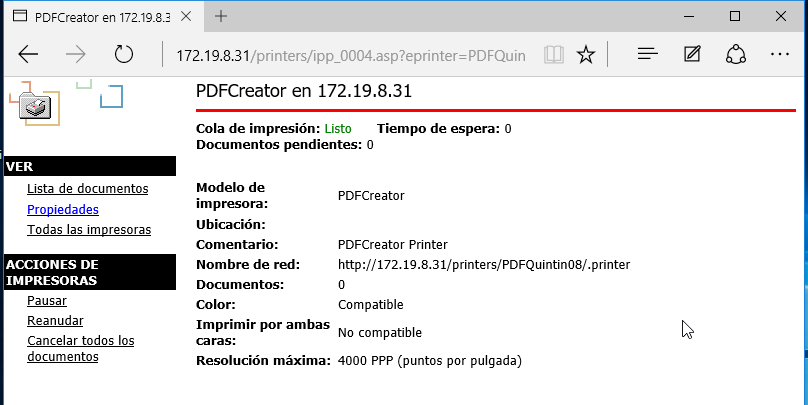
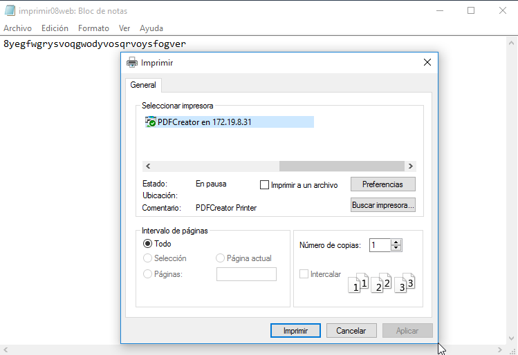
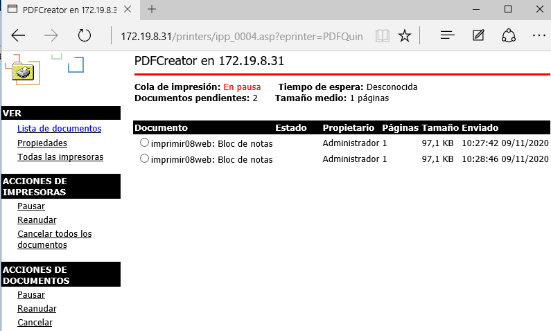
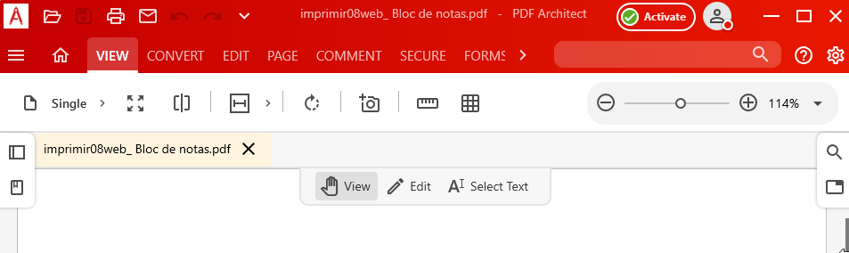

# 1. Impresora compartida
## 1.1 Rol impresión

+ Vamos al servidor
+ Instalar rol/función de servidor de impresión. Incluir impresión por Internet.

## 1.2 Instalar impresora PDF

Vamos a conectar e instalar localmente una impresora al servidor Windows Server, de modo que estén disponibles para ser accedidas por los clientes del dominio.

En nuestro caso, dado que es posible de que no tengan una impresora física en casa y no es de mucho interés forzar la instalación de una impresora que no se tiene, vamos a instalar un programa que simule una impresora de PDF.

+ Descargar PDFCreator (URL recomendada www.pdfforge.org/pdfcreator/download) e instalar.

+ En PDFCreator, configurar en perfiles -> Guardar -> Automático. Ahí establecemos la carpeta destino.

## 1.3 Probar la impresora en local

Para crear un archivo PDF no hará falta que cambies la aplicación que estés usando, simplemente ve a la opción de imprimir y selecciona "Impresora PDF", en segundos tendrás creado tu archivo PDF.

Puedes probar la nueva impresora abriendo el Bloc de notas y creando un fichero luego selecciona imprimir. Cuando finalice el proceso se abrirá un fichero PDF con el resultado de la impresión.

  + Probar la impresora remota imprimiendo documento imprimirXXs-local

# 2. Compartir por red
## 2.1 En el servidor

  Vamos a la MV del servidor.

+ Ir al Administrador de Impresión -> Impresoras
+ Elegir impresora PDFCreator.
    + Botón derecho -> Propiedades -> Compartir
    + Como nombre del recurso compartido utilizar PDFnombrealumnoXX.

## 2.2 Comprobar desde el cliente

  Vamos al cliente:

+ Buscar recursos de red del servidor. Si tarda en aparecer ponemos \\ip-del-servidor en la barra de navegación.
+ Seleccionar impresora -> botón derecho -> conectar.
  + Ponemos usuario/clave del Windows Server.

+ Ya tenemos la impresora remota configurada en el cliente.
+ Probar la impresora remota imprimiendo documento imprimirXXw-remoto.

# 3. Acceso Web

Realizaremos una configuración para habilitar el acceso web a las impresoras del dominio.
## 3.1 Instalar característica impresión WEB

+ Vamos al servidor.
+ Nos aseguramos de tener instalado el servicio "Impresión de Internet".

## 3.2 Configurar impresión WEB

En este apartado vamos a volver a agregar la impresora de red remota en el cliente, pero usando otra forma diferente de localizar la impresora.

Vamos a la MV cliente:
+ Abrimos un navegador Web.
+ Ponemos URL http://<ip-del-servidor>/printers (o http://<nombre-del-servidor>/printers) para que aparezca en nuestro navegador un entorno que permite gestionar las impresoras de dicho equipo, previa autenticación como uno de los usuarios del habilitados para dicho fin (por ejemplo el "Administrador").

+ Pincha en la opción propiedades y captura lo que se ve. Apuntar el URL asociado al nombre de red de la impresora para usarlo más adelante.

+ Agregar impresora (NO es local)
+ Crear nueva impresora usando el URL nombre de red de la impresora anterior.
## 3.3 Comprobar desde el navegador

Vamos a realizar seguidamente una prueba sencilla en tu impresora de red:

+ Accede a la configuración de la impresora a través del navegador.
    + Poner en pausa los trabajos de impresión de la impresora.
+ Ir a MV cliente.
+ Probar la impresora remota imprimiendo documento imprimirXXw-web.

  + Comprobar que al estar la impresora en pausa, el trabajo aparece en cola de impresión.

    

+ Finalmente pulsa en reanudar el trabajo para que tu documento se convierta a PDF.
+ Si tenemos problemas para que aparezca el PDF en el servidor, iniciar el programa PDFCreator y esperar un poco.

