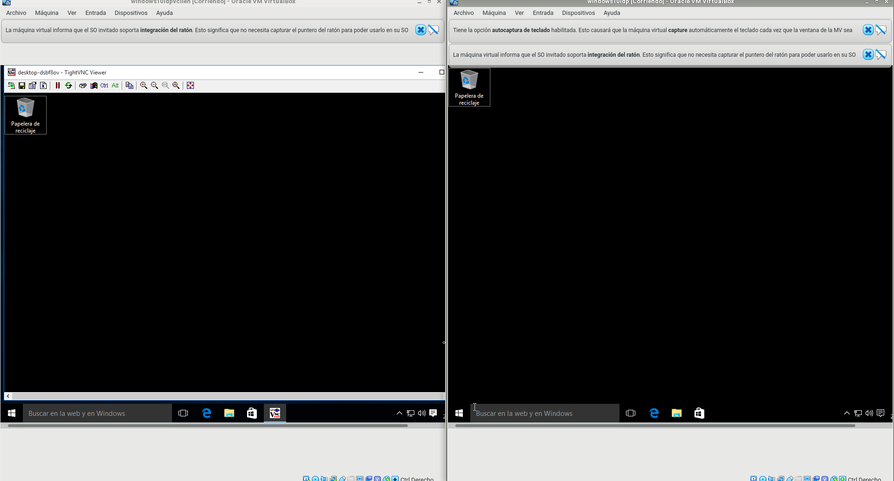
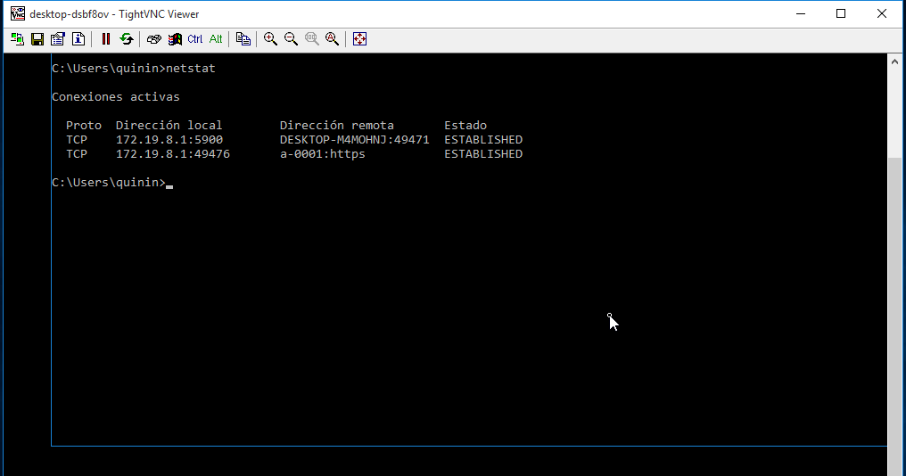

# Practica 1 VNC

1. Windows: Slave VNC

* Configurar las máquinas virtuales según este documento. Descargar TightVNC. Esta es una herramienta libre disponible
para Windows.
En el servidor VNC instalaremos TightVNC -> Custom -> Server. Esto es el servicio. Revisar la configuración del
cortafuegos del servidor VNC Windows para permitir VNC.

* En el cliente Windows instalar TightVNC -> Custom -> Viewer. Usaremos TightVNC Viewer lo seleccionaremos en la instalación.
Esto es el cliente VNC.

## 2.1 Comprobaciones finales

Para verificar que se han establecido las conexiones remotas:

  * Conectar desde Window Master hacia el Windows Slave.

  * Ir al servidor VNC y usar el comando netstat -n para ver las conexiones VNC con el cliente.

