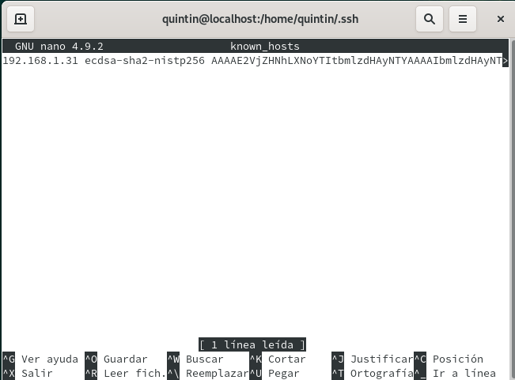

# Acceso remoto SSH

## 2.2 Primera conexión SSH desde cliente GNU/Linux

  * Ir al cliente client08g.

  * Hacer un ping server08g, comprobar la conectividad con el servidor.

  

* Usamos el comando: *Nmap -Pn server08g*, comprobar los puertos abiertos en el servidor (SSH debe estar open).

  

* Debe mostrarnos que el puerto 22 está abierto. Debe aparecer una línea como "22/tcp open ssh". Si esto falla, debemos comprobar en el servidor la configuración del cortafuegos.

* Desde el cliente GNU/Linux nos conectamos mediante *ssh rodriguez1@server08g*. Capturar imagen del intercambio de claves que se produce en el primer proceso de conexión SSH.

  

* A partir de ahora cuando nos conectamos sólo nos pide la contraseña

* Comprobar contenido del fichero *$HOME/.ssh/known_hosts* en el equipo cliente.

  

## 3.2 Comprobamos

* Comprobar qué sucede al volver a conectarnos desde los dos clientes, usando el usuario rodriguez1.

    

* Sucede que no me deja conectarme ya que ha cambiado la clave de verificación del host.

## 5. Autenticación mediante claves públicas

* Vamos a la máquina client08g.

* Iniciamos sesión con nuestro el usuario nombre-alumno de la máquina client08g.

* ssh-keygen -t rsa para generar un nuevo par de claves para el usuario en:

    * /home/quintin/.ssh/id_rsa

    * /home/quintin/.ssh/id_rsa.pub

    

* Ahora vamos a copiar la clave pública (id_rsa.pub), al fichero "authorized_keys" del usuario remoto rodriguez1 que está definido en el servidor.

* El modo recomendado es usando el comando ssh-copy-id: *ssh-copy-id rodriguez1@server08g*.

  

* Comprobar que ahora al acceder remotamente vía SSH

    * Desde client08g, NO se pide password.

    

    * Desde client08w, SI se pide el password.

## 6. Uso de SSH como túnel para X

* Instalar en el servidor una aplicación de entorno gráfico (APP1) que no esté en los clientes. Por ejemplo Geany. Si estuviera en el cliente entonces buscar otra aplicación o desinstalarla en el cliente.

* Modificar servidor SSH para permitir la ejecución de aplicaciones gráficas, desde los clientes. Consultar fichero de configuración /etc/ssh/sshd_config (Opción X11Forwarding yes).

    

* Reiniciar el servicio SSH para que se lean los cambios de configuración.

Vamos a client08g.

* zypper se APP1,comprobar que no está instalado el programa APP1.
    Vamos a comprobar desde client08g, que funciona APP1(del servidor).

  

* ssh -X rodriguez1@server08g, nos conectamos de forma remota al servidor, y ahora ejecutamos APP1 de forma remota.
    

    

## 8.1 Restricción sobre un usuario

Vamos a crear una restricción de uso del SSH para un usuario:

  * En el servidor tenemos el usuario primer-apellido2. Desde local en el servidor podemos usar sin problemas el usuario.
  * Vamos a modificar SSH de modo que al usar el usuario por SSH desde los clientes tendremos permiso denegado.

* Consultar/modificar fichero de configuración del servidor SSH (/etc/ssh/sshd_config) para restringir el acceso a determinados usuarios.
* Consultar las opciones AllowUsers, DenyUsers.

* /usr/sbin/sshd -t; echo $?, comprobar si la sintaxis del fichero de configuración del servicio SSH es correcta (Respuesta 0 => OK, 1 => ERROR).

* Comprobar la restricción al acceder desde los clientes.
  

  

  

  
