# 1. Servidor Samba (MV1)
## 1.1 Preparativos

Configurar el servidor GNU/Linux.
Nombre de equipo: serverXXg (Donde XX es el número del puesto de cada uno).
Añadir en /etc/hosts los equipos clientXXg y c.lientXXw (Donde XX es el número del puesto de cada uno).

## 1.2 Usuarios locales

Vamos a GNU/Linux, y creamos los siguientes grupos y usuarios locales:

+ Crear los grupos piratas, soldados y sambausers.

+ Crear el usuario sambaguest.

+ Para asegurarnos que nadie puede usar sambaguest para entrar en nuestra máquina mediante login, vamos a modificar este usuario y le ponemos como shell /bin/false.

+ Dentro del grupo piratas incluir a los usuarios pirata1, pirata2 y supersamba.
+ Dentro del grupo soldados incluir a los usuarios soldado1 y soldado2 y supersamba.

+ Dentro del grupo sambausers, poner a todos los usuarios soldados, piratas, supersamba y a sambaguest.

## 1.3 Crear las carpetas para los futuros recursos compartidos
+ Creamos la carpeta base para los recursos de red de Samba de la siguiente forma:
    + mkdir /srv/sambaXX
    + chmod 755 /srv/sambaXX

+ Vamos a crear las carpetas para los recursos compartidos de la siguiente forma:

  * Recurso 	Directorio 	Usuario 	Grupo 	Permisos

    * Public 	/srv/sambaXX/public.d 	supersamba 	sambausers 	770

    * Castillo 	/srv/sambaXX/castillo.d 	supersamba 	soldados 	770

    * Barco 	/srv/sambaXX/barco.d 	supersamba 	piratas 	770

## 1.4 Configurar el servidor Samba

* cp /etc/samba/smb.conf /etc/samba/smb.conf.bak, hacer una copia de seguridad del fichero de configuración antes de modificarlo.

* Yast -> Samba Server
    Workgroup: curso2021
    Sin controlador de dominio. En la pestaña de Inicio definimos

* Iniciar el servicio durante el arranque de la máquina.

* Ajustes del cortafuegos -> Abrir puertos

## 1.5 Crear los recursos compartidos de red

Vamos a configurar los recursos compartidos de red en el servidor. Podemos hacerlo modificando el fichero de configuración. El fichero es */etc/samba/smb.conf*

        [global]
        netbios name = serverXXg
        workgroup = cursoXXYY
        server string = Servidor de nombre-alumno-XX
        security = user
        map to guest = bad user
        guest account = sambaguest

        [public]
        comment = public de nombre-alumno-XX
        path = /srv/sambaXX/public.d
        guest ok = yes
        read only = yes

        [castillo]
        comment = castillo de nombre-alumno-XX
        path = /srv/sambaXX/castillo.d
        read only = no
        valid users = @soldados

        [barco]
        comment = barco de nombre-alumno-XX
        path = /srv/sambaXX/barco.d
        read only = no
        valid users = pirata1, pirata2

  + *more /etc/samba/smb.conf*, consultar el contenido del fichero de configuración.

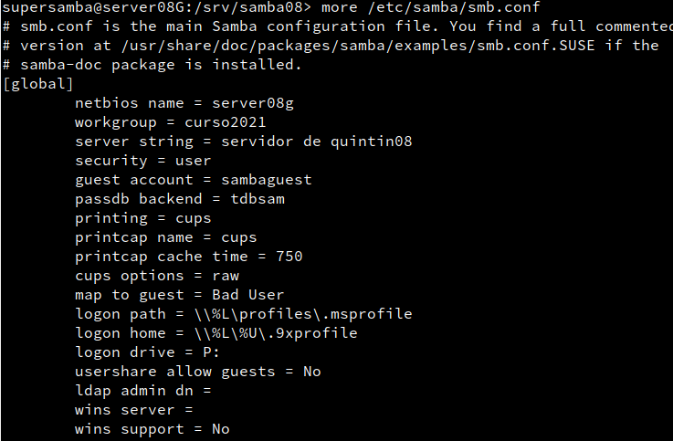

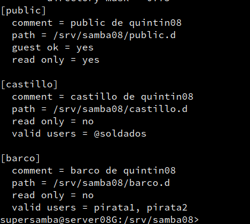

## 1.6 Usuarios Samba

Después de crear los usuarios en el sistema, hay que añadirlos a Samba.

  * smbpasswd -a USUARIO, para crear clave Samba de USUARIO.

  * USUARIO son los usuarios que se conectarán a los recursos compartidos SMB/CIFS.

  * Esto hay que hacerlo para cada uno de los usuarios de Samba.
    pdbedit -L, para comprobar la lista de usuarios Samba.

## 1.7 Reiniciar

  Ahora que hemos terminado con el servidor, hay que recargar los ficheros de configuración del servicio. Esto es, leer los cambios de configuración. Podemos hacerlo por Yast -> Servicios, o usar los comandos: systemctl restart smb y systemctl restart nmb.

* Comandos Servicio 	Descripción
  * systemctl stop SERVICE-NAME 	Parar
  * systemctl start SERVICE-NAME 	Iniciar
  * systemctl restart SERVICE-NAME 	Parar e iniciar
  * systemctl reload SERVICE-NAME 	Volver a releer la configuración
  * systemctl status SERVICE-NAME 	Ver estado

  * sudo lsof -i, comprobar que el servicio SMB/CIF está a la escucha.

# 2. Windows

  Configurar el cliente Windows.
    Usar nombre y la IP que hemos establecido al comienzo.
    Configurar el fichero ...\etc\hosts de Windows.

  En los clientes Windows el software necesario viene preinstalado.

## 2.1 Cliente Windows GUI

Desde un cliente Windows vamos a acceder a los recursos compartidos del servidor Samba.

Escribimos \\ip-del-servidor-samba y vemos lo siguiente:

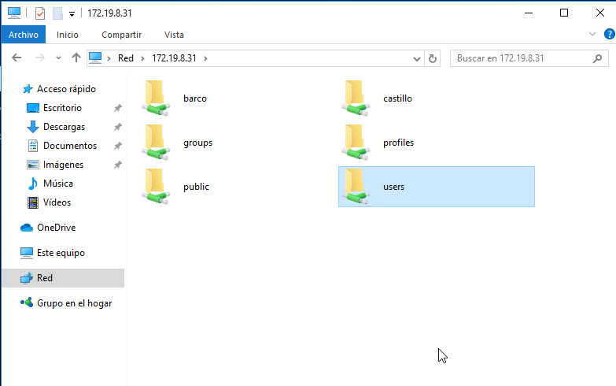

* Acceder al recurso compartido con el usuario invitado
    * net use para ver las conexiones abiertas.
    * net use * /d /y, para borrar todas las conexión SMB/CIFS que se hadn realizado.

* Acceder al recurso compartido con el usuario soldado
    * net use para ver las conexiones abiertas.
    * net use * /d /y, para borrar todas las conexión SMB/CIFS que se hadn realizado.
* Acceder al recurso compartido con el usuario pirata
    * Ir al servidor Samba.

Comandos para comprobar los resultados:

  * smbstatus, desde el servidor Samba.

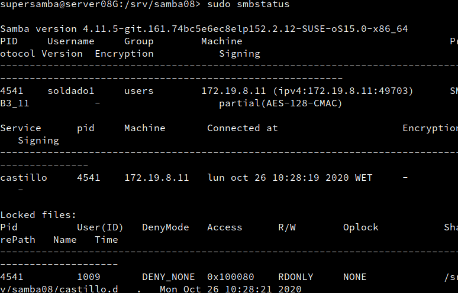

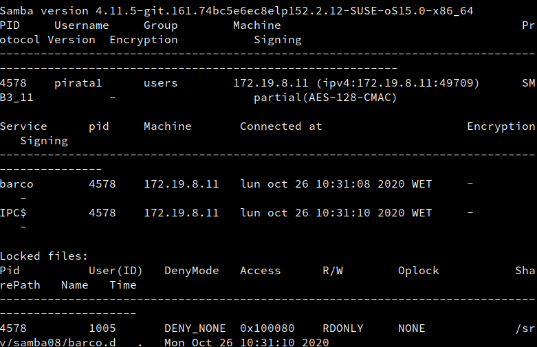

  * lsof -i, desde el servidor Samba.

## 2.2 Cliente Windows comandos

Abrir una shell de windows.

* net use * /d /y, para cerrar las conexiones SMB.

* net use ahora vemos que NO hay conexiones establecidas.

* net view \\IP-SERVIDOR-SAMBA, para ver los recursos de esta máquina.

Para REVISAR:

* net view, para ver las máquinas (SMB/CIFS) accesibles por la red.

Montar el recurso barco de forma persistente.

* net use S: \\IP-SERVIDOR-SAMBA\recurso contraseña /USER:usuario /

* p:yes crear una conexión con el recurso compartido y lo monta en la unidad S. Con la opción /p:yes hacemos el montaje persistente. De modo que se mantiene en cada reinicio de máquina.

* net use, comprobamos.

Ahora podemos entrar en la unidad S ("s:") y crear carpetas, etc.

  * smbstatus, desde el servidor Samba.

  * lsof -i, desde el servidor Samba.

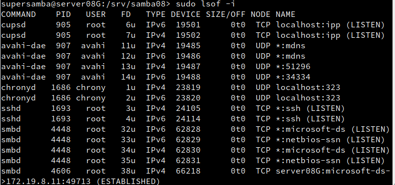

# 3 Cliente GNU/Linux

Configurar el cliente GNU/Linux.
Usar nombre y la IP que hemos establecido al comienzo. Configurar el fichero /etc/hosts de la máquina.

## 3.1 Cliente GNU/Linux GUI

Desde en entorno gráfico, podemos comprobar el acceso a recursos compartidos SMB/CIFS.

Algunas herramientas para acceder a recursos Samba por entorno gráfico: Yast en OpenSUSE, Nautilus en GNOME, Konqueror en KDE, En Ubuntu podemos ir a "Lugares -> Conectar con el servidor...", También podemos instalar "smb4k".

En el momento de autenticarse para acceder al recurso remoto, poner en Dominio el nombre-netbios-del-servidor-samba.

* Probar a crear carpetas/archivos en castillo y en barco.

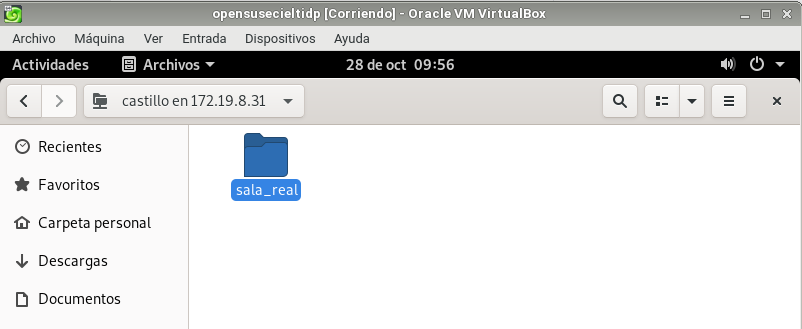

* Comprobar que el recurso public es de sólo lectura.

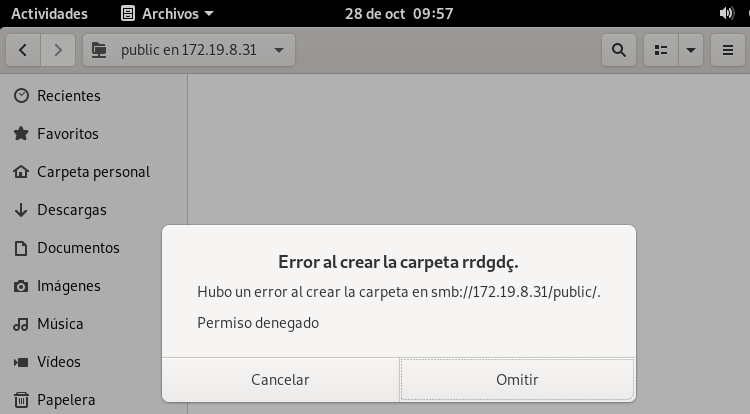

Comprobación:

* smbstatus, desde el servidor Samba.

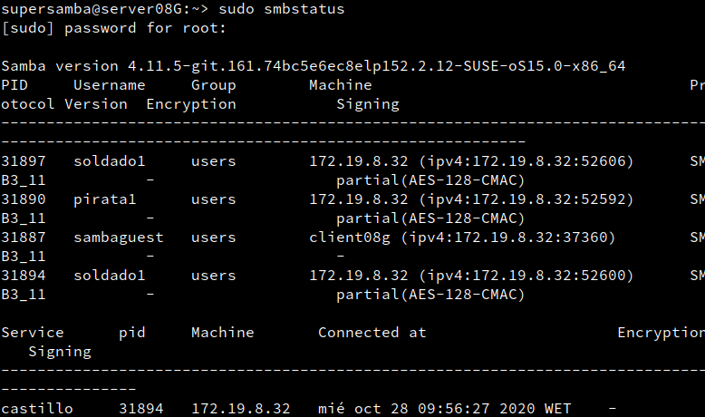

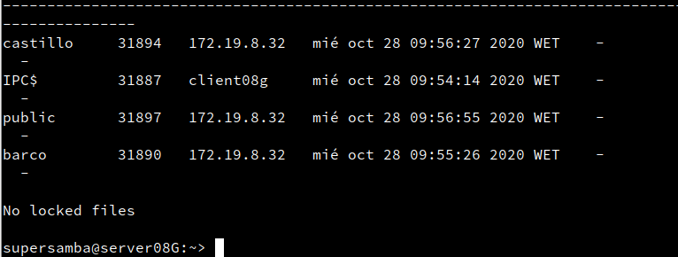
* lsof -i, desde el servidor Samba.

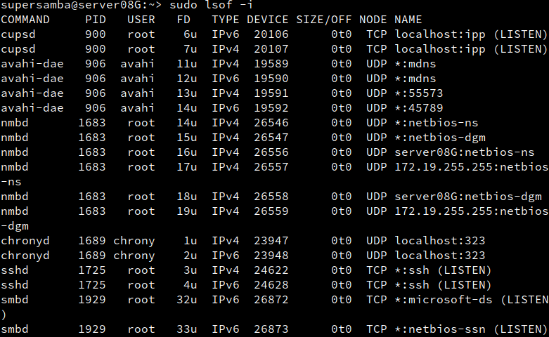

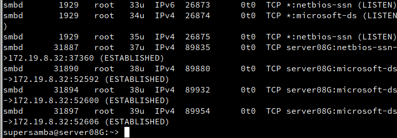

## 3.2 Cliente GNU/Linux comandos

Vamos a un equipo GNU/Linux que será nuestro cliente Samba. Desde este equipo usaremos comandos para acceder a la carpeta compartida.

Probar desde OpenSUSE: smbclient --list IP-SERVIDOR-SAMBA, muestra los recursos SMB/CIFS de un equipo.

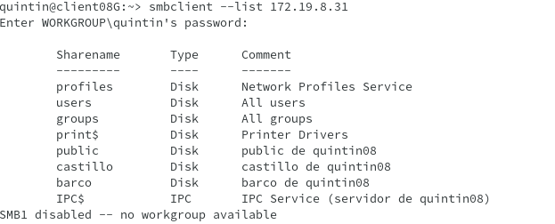

* Ahora crearemos en local la carpeta /mnt/remotoXX/castillo.

  * mount -t cifs //172.AA.XX.31/castillo /mnt/remotoXX/castillo -o username=soldado1

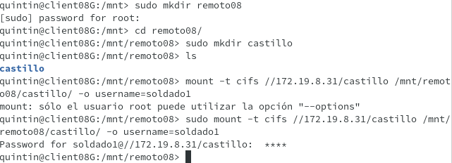

* df -hT, para comprobar que el recurso ha sido montado.

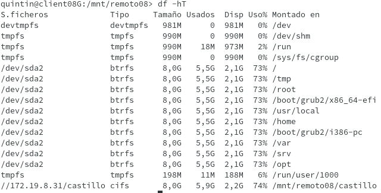

Comprobar
* smbstatus, desde el servidor Samba.

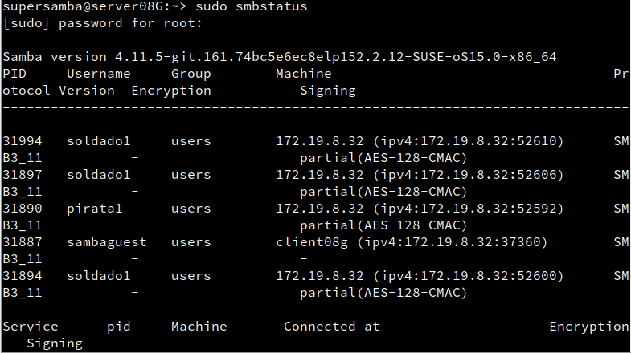

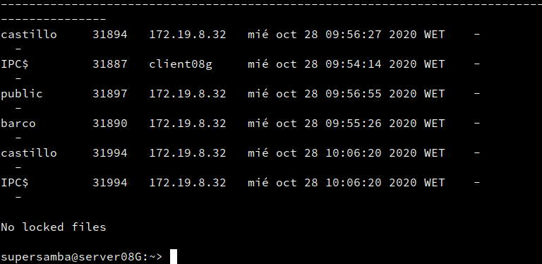

* lsof -i, desde el servidor Samba.

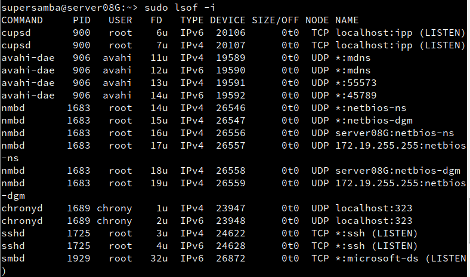

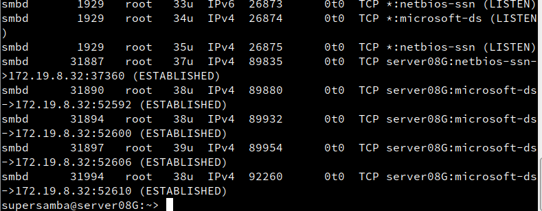

## 3.3 Montaje automático

Reiniciar la MV.

df -hT. Los recursos ya NO están montados. El montaje anterior fue temporal.

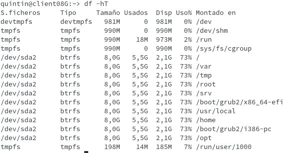

* Para configurar acciones de montaje automáticos cada vez que se inicie el equipo, debemos configurar el fichero /etc/fstab. Veamos un ejemplo:
    * //smb-serverXX/public /mnt/remotoXX/public cifs
    * username=soldado1,password=clave 0 0

* Reiniciar el equipo y comprobar que se realiza el montaje automático al inicio.

Al reiniciar el equipo no me permitió iniciar la máquina por un fallo en el archivo de configuración. 
